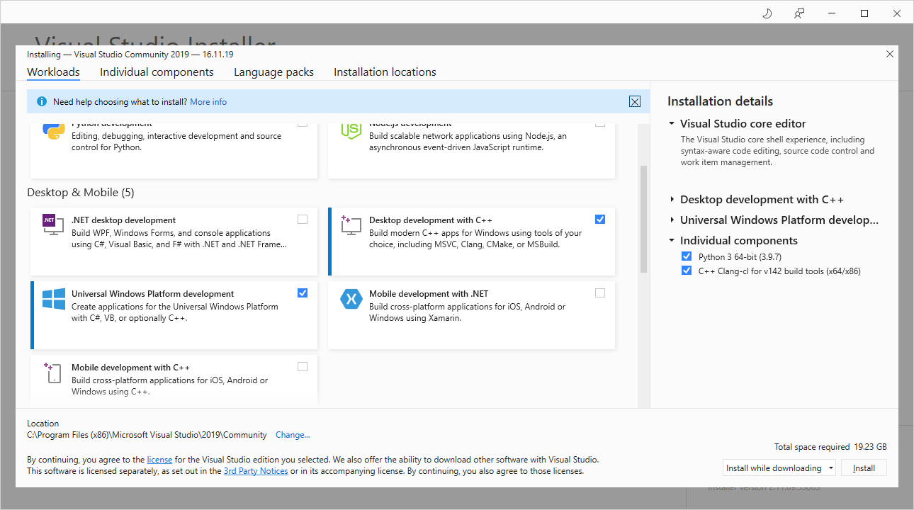

README
===========================
Collect some EFI tools here.

* Type1 : UefiMain         (finally EntryPoint)
* Type2 : ShellCEntryLib   (ENTRY_POINT in inf) -> ShellAppMain   (finally EntryPoint)
* Type3 : ShellCEntryLib   (ENTRY_POINT in inf) -> ShellAppMain   (LibC)               -> main (finally EntryPoint)
* Type4 : ShellMain        (ENTRY_POINT in inf) -> ShellCEntryLib (UefiShellCEntryLib) -> ShellAppMain  (LibC)       -> main (finally EntryPoint)

****

## Index
- [README](#readme)
  - [Index](#index)
    - [Requirement](#requirement)
    - [Installation](#installation)

### Requirement
___
[Python 2.7.15  x86 ](https://www.python.org/ftp/python/2.7.15/python-2.7.15.msi)
[Python 2.7.15 amd64](https://www.python.org/ftp/python/2.7.15/python-2.7.15.amd64.msi)

[vs2015 pro_enu u3](http://download.microsoft.com/download/e/b/c/ebc2c43f-3821-4a0b-82b1-d05368af1604/vs2015.3.pro_enu.iso)
[vs2015 ent_enu u3](http://download.microsoft.com/download/8/4/3/843ec655-1b67-46c3-a7a4-10a1159cfa84/vs2015.3.ent_enu.iso)
[vs2015 com_enu u3](http://download.microsoft.com/download/b/e/d/bedddfc4-55f4-4748-90a8-ffe38a40e89f/vs2015.3.com_enu.iso)

[vs2015 pro_cht u3](http://download.microsoft.com/download/6/c/f/6cfe65ad-a72a-4828-8477-6abf91daa920/vs2015.3.pro_cht.iso)
[vs2015 ent_cht u3](http://download.microsoft.com/download/9/d/f/9df3e0f6-519d-43ac-952c-ff1d3bd5e486/vs2015.3.ent_cht.iso)
[vs2015 com_cht u3](http://download.microsoft.com/download/7/6/d/76dd809a-d4ae-4e0e-9a24-ad55576e5c8a/vs2015.3.com_cht.iso)

[edk2-stable201908](https://github.com/tianocore/edk2/archive/edk2-stable201908.zip)
[edk2-BaseTools-win32-master](https://github.com/tianocore/edk2-BaseTools-win32/archive/master.zip)
[edk2-libc-master](https://github.com/tianocore/edk2-libc/archive/master.zip)
[nasm-2.14.02-win64](https://www.nasm.us/pub/nasm/releasebuilds/2.14.02/win64/nasm-2.14.02-win64.zip)
[iasl-win-20190816](https://acpica.org/sites/acpica/files/iasl-win-20190816.zip)

### Installation
___

